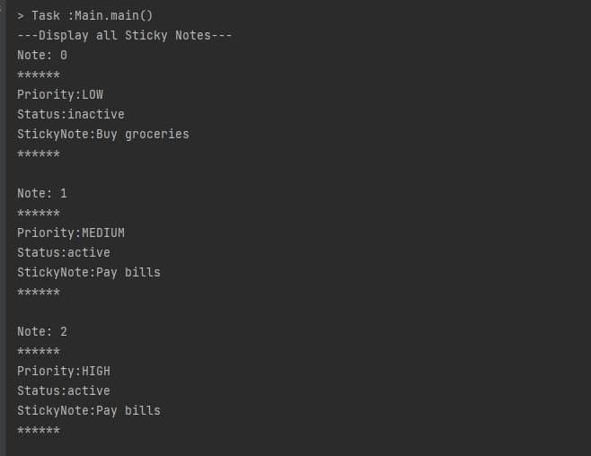
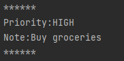
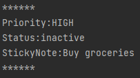
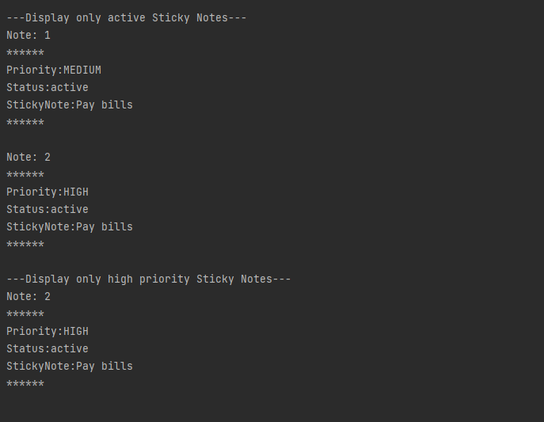

## Topics Covered:
- Extending parent classes in child classes
- Implementing static and constant variables
- Enum types

## This assessment will assess your mastery of the following Learning Outcomes:
* You will be able to create child classes that utilize properties or methods from a parent class
* You will be able to override and overload methods from a parent class
* You will be able to create constructors or methods with multiple sets of parameters
* You will be able to create a class representing an idea with properties and methods
* You will be able to define an object based on its accessible properties and methods, hiding internal properties and methods
* You will be able to read methods that reassign( or calls methods on its arguments and predict which changes will be visible 
* You will be able to create a static method that accepts the instance as an argument
* You will be able to define and use constants in efficient ways
* You will be able to implement an enum type to represent a set of predefined constants
* You will be able to implement code that uses a defined enum type
* You will be able to write code that is organized, easily understood, and free of errors

# Assignment
Open [**the assignment**](https://classroom.github.com/a/l3HTgrBT) and clone it to your computer.

You will be implementing a Sticky Note program that allows you to post and remove notes with different statuses indicating whether or not a note is active and different priority levels indicating importance.   

  

## Instructions
The implementation will include a parent class __Note__ that will contain the basic features of the object and a child class __StickyNote__ that extends __Note__.

### Define Priority Enum
Define an Enum with the name `Priority` with values:
* LOW
* MEDIUM
* HIGH

### Parent class: Note

The __Note__ class should hold a message and override the `toString()` method to return a String that can be displayed to the console. Do not use `System.out.println`. `toString()` should return formatted String.

__Attributes:__
String message
Priority priority

__Constructors:__
`Note(String message)`
`Note(String message, Priority priority)`

__Methods:__
`void setMessage(String message)`
`String getMessage()`
`void setPriority(Priority priority)`
`Priority getPriority()`
`void setStatus(String status)`
`String getStatus()`
`public String toString()`

Override `toString()` method to return a formatted String which contains the `priority` and the `message`.

The **Note** string should look like this:

### Child class: StickyNote

The __StickyNote__ class will be a specialized type of note that extends the properties in __Note__ to include additional features: 

__Attributes:__
`String status`

__Constructors:__
`StickyNote(String message)`
`StickyNote(String message, Priority priority)`

StickyNote constructors should call super() to use the parent `Note()` constructors and then additionally set the `status` property to "active".

__Methods:__
`void setStatus(String status)`
`String getStatus()`
`public String toString()`

Override `toString()` to return a formatted String which contains the `priority`, `status`, and the `message`. 

The **StickyNote** string should look like this:

## Program execution
In the __Main.java__ class: 

Write a `main()` method to handle the following execution: 
1. Create a dynamic array of StickyNote named `noteArray` 
2. Add three notes with these messages and priorities:
* MESSAGE_1 = "Buy groceries" (set to LOW Priority)
* MESSAGE_2 = "Pay bills" (set to MEDIUM Priority)
* MESSAGE_3 = "Do homework" (set to HIGH Priority)
    
1. Update the status of the 1st note to "inactive"
2. Display all notes
3. Display only active notes
4. Display only high priority notes

## Main class attributes
A static dynamic array `noteArray` of type __StickyNote__ will be used to store all the note objects. 

When the program is run, the user will be provided with a menu to 
1. Add a note
2. Remove a note
3. Display notes 

## Main class methods
* addNote(String message, Priority priority)
* peelNote(ArrayList<StickyNote> noteArray, int index)
* displayAllNotes(ArrayList<StickyNote> noteArray)
* displayActiveNotes(ArrayList<StickyNote> noteArray)
* displayPriorityNotes(ArrayList<StickyNote> noteArray, Priority priority )
 
#### 1. Add note: 
This method takes in arguments __message__ and __priority__ and returns a __StickyNote__ object. Defaults __status__ attribute to ***active***.   

The created object will be added to the `noteArray` dynamic array.

#### 2. Peel Sticky Note: 
This method takes in __noteArray__ and __index__. Updates the status attribute at __index__ to "inactive". The StickyNote is *not* deleted, but it will have a status of "inactive".

#### 3. Display notes: 
If the user selects display, loop through the __StickyNote__ array and display each note according to specific criteria. Use the __toString()__ method that was built as part of __StickyNote__ to return the formatted String.

There are three different *static* display methods. Add logic as needed in each to check the status or priority to print out only the notes specified. 

* displayAllNotes()
* displayActiveNotes()
* displayPriorityNotes(Priority priority)

Example of display: 

  

## Clean Code
Remember to focus on writing clean code!  
* Create functions that isolate the different parts of your code.
* Label your variables and functions cleanly.
* Make sure there is no duplication in your code.

# Testing if you did it right
Inside the `MainTest.java` and `NoteTest.java` files, there are tests to help you verify that your code is working.  Run the test code and make sure those are working as expected.

# Submission
Submit the URL to your Github repository.

## Grading
This activity will be graded according to the following completion criteria and learning outcomes:

## Completion Criteria
* A Note class is defined with required attributes, constructors, and methods
* A StickyNote class is defined which extends Note and has additional required attributes, constructors, and methods
* The Main class defines a dynamic array of StickyNotes 
* The Main class defines methods `addNote` and `peelNote` to add elements to the array and update status of notes in the array
* The Main class defines required `displayAllNotes`, `displayActiveNotes`, and `displayPriorityNotes` methods for displaying StickyNotes.
